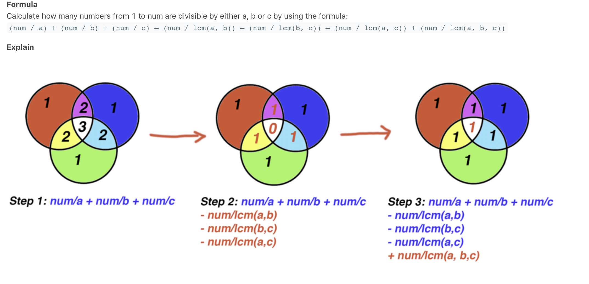

#### 最大公约数（GCD），最小公倍数（LCM）  
Calculate how many numbers from 1 to num are divisible by either a, b or c by using the formula:
(num / a) + (num / b) + (num / c) – (num / lcm(a, b)) – (num / lcm(b, c)) – (num / lcm(a, c)) + (num / lcm(a, b, c))  

LC1201
Write a program to find the n-th ugly number.
Ugly numbers are positive integers which are divisible by a or b or c.  
```Java
class Solution {
    public int nthUglyNumber(int n, int a, int b, int c) {
        int left=1;
        int right=Integer.MAX_VALUE;
        while(left<=right){
            int mid=left+(right-left)/2;
            int count=getCount(a,b,c,mid);
            if(count>=n){
                right=mid-1;
            }else{
                left=mid+1;
            }
        }

        return left;
    }

    public int getCount(long a,long b,long c,long num){
        return (int)((num/a)+(num/b)+(num/c)
            -(num/LCM(a,b))-(num/LCM(a,c))-(num/LCM(b,c))
            +(num/LCM(a,LCM(b,c))));
    }

    public long GCD(long a,long b){
        if(a==0) return b;
        return GCD(b%a,a);
    }

    public long LCM(long a,long b){
        return a*b/GCD(a,b);
    }
}
```


#### Bezout's Identity  
The basic idea is that for integers a and b, if gcd(a,b) = d, then there exist integers x and y, s.t a * x + b * y = d;

This can be generalized for (n >= 2) . e.g. if gcd(a,b,c) = d, then there exist integers x, y, and z, s.t, a* x + b*y + c * z = d.  

LC1250  
