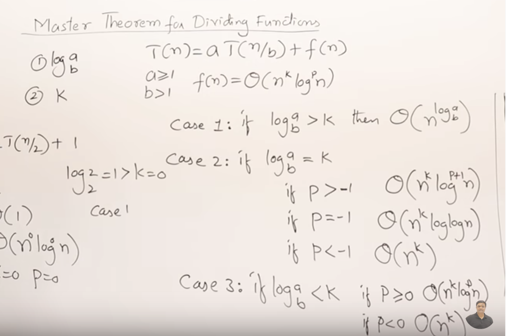
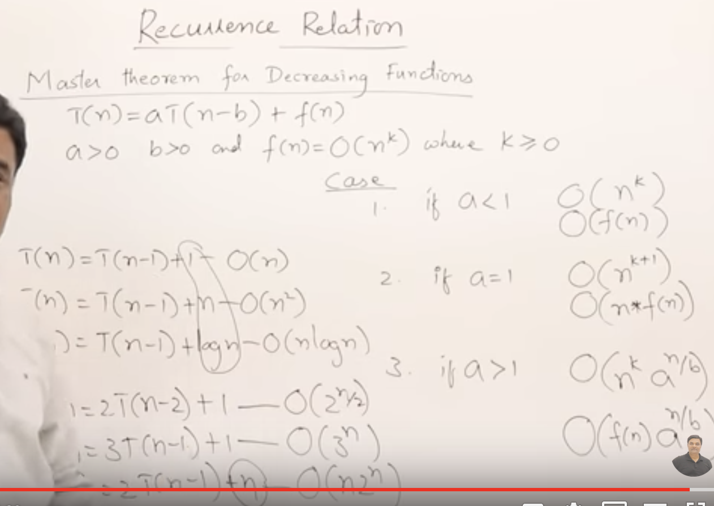

1. Minimax and Alpha–beta pruning   
2. 主方法求解递归式  
3. Trie  
4. Skyline Problem  
5. Jarvis March  
6. LRU and LFU  
7. bucket sort  
8. Skiplist
9. Reservoir sampling
10. monotone stack

## Minimax and Alpha–beta pruning  
```
function alphabeta(node, depth, α, β, maximizingPlayer) is
    if depth = 0 or node is a terminal node then
        return the heuristic value of node
    if maximizingPlayer then
        value := −∞
        for each child of node do
            value := max(value, alphabeta(child, depth − 1, α, β, FALSE))
            α := max(α, value)
            if α ≥ β then
                break (* β cut-off *)
        return value
    else
        value := +∞
        for each child of node do
            value := min(value, alphabeta(child, depth − 1, α, β, TRUE))
            β := min(β, value)
            if α ≥ β then
                break (* α cut-off *)
        return value  
```  

## 主方法求解递归式  

<a href="https://www.jianshu.com/p/4d0b005782d9">1</a>
    定理4.1（主定理） 令 a≥1 和 b>1 是常数，f(n) 是一个函数，T(n) 是定义在非负整数上的递归式：
    T(n) = aT(n/b) + f(n)
    那么T(n)有如下渐进界：

    若对某个常数 ε>0 有 f(n) = O(nlogba-ε)，则 T(n) = Θ(nlogba) 。
    若 f(n) = Θ(nlogba)，则 T(n) = Θ(nlogba lgn) 。
    若对某个常数 ε>0 有 f(n) = Ω(nlogba+ε)，且对某个常数 c<1 和所有足够大的 n 有 af(n/b) ≤ cf(n)，则 T(n) = Θ(f(n)) 。




## Trie  
```Java
/**
 * Date 04/25/2016
 * @author Tushar Roy
 *
 * Insert/delete/search into trie data structure
 *
 * Reference
 * https://en.wikipedia.org/wiki/Trie
 */
public class Trie {

    private class TrieNode {
        Map<Character, TrieNode> children;
        boolean endOfWord;
        public TrieNode() {
            children = new HashMap<>();
            endOfWord = false;
        }
    }

    private final TrieNode root;
    public Trie() {
        root = new TrieNode();
    }

    /**
     * Iterative implementation of insert into trie
     */
    public void insert(String word) {
        TrieNode current = root;
        for (int i = 0; i < word.length(); i++) {
            char ch = word.charAt(i);
            TrieNode node = current.children.get(ch);
            if (node == null) {
                node = new TrieNode();
                current.children.put(ch, node);
            }
            current = node;
        }
        //mark the current nodes endOfWord as true
        current.endOfWord = true;
    }

    /**
     * Recursive implementation of insert into trie
     */
    public void insertRecursive(String word) {
        insertRecursive(root, word, 0);
    }


    private void insertRecursive(TrieNode current, String word, int index) {
        if (index == word.length()) {
            //if end of word is reached then mark endOfWord as true on current node
            current.endOfWord = true;
            return;
        }
        char ch = word.charAt(index);
        TrieNode node = current.children.get(ch);

        //if node does not exists in map then create one and put it into map
        if (node == null) {
            node = new TrieNode();
            current.children.put(ch, node);
        }
        insertRecursive(node, word, index + 1);
    }

    /**
     * Iterative implementation of search into trie.
     */
    public boolean search(String word) {
        TrieNode current = root;
        for (int i = 0; i < word.length(); i++) {
            char ch = word.charAt(i);
            TrieNode node = current.children.get(ch);
            //if node does not exist for given char then return false
            if (node == null) {
                return false;
            }
            current = node;
        }
        //return true of current's endOfWord is true else return false.
        return current.endOfWord;
    }

    /**
     * Recursive implementation of search into trie.
     */
    public boolean searchRecursive(String word) {
        return searchRecursive(root, word, 0);
    }
    private boolean searchRecursive(TrieNode current, String word, int index) {
        if (index == word.length()) {
            //return true of current's endOfWord is true else return false.
            return current.endOfWord;
        }
        char ch = word.charAt(index);
        TrieNode node = current.children.get(ch);
        //if node does not exist for given char then return false
        if (node == null) {
            return false;
        }
        return searchRecursive(node, word, index + 1);
    }

    /**
     * Delete word from trie.
     */
    public void delete(String word) {
        delete(root, word, 0);
    }

    /**
     * Returns true if parent should delete the mapping
     */
    private boolean delete(TrieNode current, String word, int index) {
        if (index == word.length()) {
            //when end of word is reached only delete if currrent.endOfWord is true.
            if (!current.endOfWord) {
                return false;
            }
            current.endOfWord = false;
            //if current has no other mapping then return true
            return current.children.size() == 0;
        }
        char ch = word.charAt(index);
        TrieNode node = current.children.get(ch);
        if (node == null) {
            return false;
        }
        boolean shouldDeleteCurrentNode = delete(node, word, index + 1);

        //if true is returned then delete the mapping of character and trienode reference from map.
        if (shouldDeleteCurrentNode) {
            current.children.remove(ch);
            //return true if no mappings are left in the map.
            return current.children.size() == 0;
        }
        return false;
    }
}
```
LC1233  
Given a list of folders, remove all sub-folders in those folders and return in any order the folders after removing.

If a folder[i] is located within another folder[j], it is called a sub-folder of it.

The format of a path is one or more concatenated strings of the form: / followed by one or more lowercase English letters. For example, /leetcode and /leetcode/problems are valid paths while an empty string and / are not.  
```Java
class Solution {
    public List<String> removeSubfolders(String[] folder) {
        Trie root=new Trie();
        for(String f:folder){
            Trie cur=root;
            String[] parts=f.substring(1).split("/");
            for(String part:parts){
                if(!cur.child.containsKey(part)){
                    cur.child.put(part,new Trie());
                }
                cur=cur.child.get(part);
            }
            cur.word=f;
        }
        getList(root);
        return res;
    }

    List<String> res=new ArrayList();
    public void getList(Trie root){
        for(Map.Entry<String,Trie> entry:root.child.entrySet()){
            if(entry.getValue().word!=null){
                res.add(entry.getValue().word);
            }else{
                getList(entry.getValue());
            }
        }
    }
}

class Trie{
    Map<String,Trie> child=new HashMap();
    String word=null;
}
```   

LC642  
Design a search autocomplete system for a search engine. Users may input a sentence (at least one word and end with a special character '#'). For each character they type except '#', you need to return the top 3 historical hot sentences that have prefix the same as the part of sentence already typed.

```c++  
struct TrieNode{
    int times=0;
    map<char,TrieNode*> children;
    string sent;
};

class AutocompleteSystem {
public:
    AutocompleteSystem(vector<string>& sentences, vector<int>& times) {
        root=new TrieNode();
        for(int i=0;i<sentences.size();i++){
            buildTrie(sentences[i],times[i]);
        }
        cur=root;
    }

    void buildTrie(string &s,int time){
        TrieNode* node=root;
        for(int i=0;i<s.size();i++){
            if(node->children.find(s[i])==node->children.end()){
                node->children[s[i]]=new TrieNode();
            }
            node=node->children[s[i]];
        }
        node->times+=time;
        node->sent=s;
    }

    vector<string> input(char c) {
        if(c=='#'){
            cur->times++;
            cur->sent=curString;
            curString="";
            cur=root;
            return {};
        }

        if(cur->children.find(c)==cur->children.end()){
            cur->children[c]=new TrieNode();
        }
        cur=cur->children[c];
        curString+=c;

        vector<pair<string,int>> strVsCount;
        findString(strVsCount,cur);

        vector<string> res;
        while(strVsCount.size()>0){
            res.insert(res.begin(),strVsCount.front().first);
            pop_heap(strVsCount.begin(),strVsCount.end(),comparePair);
            strVsCount.pop_back();
        }
        return res;
    }

    static bool comparePair(pair<string,int>& p1,pair<string,int>& p2){
        return p1.second==p2.second?compare(p1.first,p2.first):p1.second>p2.second;  
    }

    static bool compare(string &s1,string &s2){
        int len1=s1.size();
        int len2=s2.size();
        int i=0;
        while(i<len1 && i<len2){
            if(s1[i]!=s2[i]){
                return s1[i]<s2[i];
            }
            i++;
        }
        return len1<len2;
    }

    void findString(vector<pair<string,int>> &strVsCount,TrieNode* node){
        if(node->times>0){
            strVsCount.push_back({node->sent,node->times});
            push_heap(strVsCount.begin(),strVsCount.end(),comparePair);
            if(strVsCount.size()>3){
                pop_heap(strVsCount.begin(),strVsCount.end(),comparePair);
                strVsCount.pop_back();
            }
        }
        for(auto &m:node->children){
            findString(strVsCount,m.second);
        }
    }
private:
    TrieNode* root;
    TrieNode* cur;
    string curString;
};

/**
 * Your AutocompleteSystem object will be instantiated and called as such:
 * AutocompleteSystem* obj = new AutocompleteSystem(sentences, times);
 * vector<string> param_1 = obj->input(c);
 */
 ```

## Skyline Problem  
LC218  
```Java
/**
 * Date 01/07/2016
 * @author Tushar Roy
 *
 * Given skyline of a city merge the buildings
 *
 * Time complexity is O(nlogn)
 * Space complexity is O(n)
 *
 * References
 * https://leetcode.com/problems/the-skyline-problem/
 * https://leetcode.com/discuss/67091/once-for-all-explanation-with-clean-java-code-nlog-time-space
 */
public class SkylineDrawing {

    /**
     * Represents either start or end of building
     */
    static class BuildingPoint implements Comparable<BuildingPoint> {
        int x;
        boolean isStart;
        int height;

        @Override
        public int compareTo(BuildingPoint o) {
            //first compare by x.
            //If they are same then use this logic
            //if two starts are compared then higher height building should be picked first
            //if two ends are compared then lower height building should be picked first
            //if one start and end is compared then start should appear before end
            if (this.x != o.x) {
                return this.x - o.x;
            } else {
                return (this.isStart ? -this.height : this.height) - (o.isStart ? -o.height : o.height);
            }
        }
     }

    public List<int[]> getSkyline(int[][] buildings) {

        //for all start and end of building put them into List of BuildingPoint
        BuildingPoint[] buildingPoints = new BuildingPoint[buildings.length*2];
        int index = 0;
        for(int building[] : buildings) {
            buildingPoints[index] = new BuildingPoint();
            buildingPoints[index].x = building[0];
            buildingPoints[index].isStart = true;
            buildingPoints[index].height = building[2];

            buildingPoints[index + 1] = new BuildingPoint();
            buildingPoints[index + 1].x = building[1];
            buildingPoints[index + 1].isStart = false;
            buildingPoints[index + 1].height = building[2];
            index += 2;
        }
        Arrays.sort(buildingPoints);

        //using TreeMap because it gives log time performance.
        //PriorityQueue in java does not support remove(object) operation in log time.
        TreeMap<Integer, Integer> queue = new TreeMap<>();
        //PriorityQueue<Integer> queue1 = new PriorityQueue<>(Collections.reverseOrder());
        queue.put(0, 1);
        //queue1.add(0);
        int prevMaxHeight = 0;
        List<int[]> result = new ArrayList<>();
        for(BuildingPoint buildingPoint : buildingPoints) {
            //if it is start of building then add the height to map. If height already exists then increment
            //the value
            if (buildingPoint.isStart) {
                queue.compute(buildingPoint.height, (key, value) -> {
                    if (value != null) {
                        return value + 1;
                    }
                    return 1;
                });
              //  queue1.add(cp.height);
            } else { //if it is end of building then decrement or remove the height from map.
                queue.compute(buildingPoint.height, (key, value) -> {
                    if (value == 1) {
                        return null;
                    }
                    return value - 1;
                });
               // queue1.remove(cp.height);
            }
            //peek the current height after addition or removal of building x.
            int currentMaxHeight = queue.lastKey();
            //int currentMaxHeight = queue1.peek();
            //if height changes from previous height then this building x becomes critcal x.
            // So add it to the result.
            if (prevMaxHeight != currentMaxHeight) {
                result.add(new int[]{buildingPoint.x, currentMaxHeight});
                prevMaxHeight = currentMaxHeight;
            }
        }
        return result;
    }

    public static void main(String args[]) {
        int [][] buildings = {{1,3,4},{3,4,4},{2,6,2},{8,11,4}, {7,9,3},{10,11,2}};
        SkylineDrawing sd = new SkylineDrawing();
        List<int[]> criticalPoints = sd.getSkyline(buildings);
        criticalPoints.forEach(cp -> System.out.println(cp[0] + " " + cp[1]));

    }
}
```

## Jarvis March   
LC587  

introduction:  
```Java
/**
 * @author Tushar Roy
 * Date 10/11/2107
 *
 * Convex hull or convex envelope of a set X of points in the Euclidean plane or in a Euclidean space
 * (or, more generally, in an affine space over the reals) is the smallest convex set that contains X.
 *
 * Jarvis March is finding convex or gift wrapping algorithm.
 *
 * Time complexity O(nh)
 *    n - number of points
 *    h - number of points on the boundary.
 *    Worst case O(n^2)
 *
 * Space complexity O(n^2)
 *
 * Reference
 * https://leetcode.com/problems/erect-the-fence/description/
 * https://en.wikipedia.org/wiki/Convex_hull
 * https://en.wikipedia.org/wiki/Gift_wrapping_algorithm
 */
public class JarvisMarchConvexHull {

    class Point{
        int x;
        int y;
        Point(int x, int y){
            this.x = x;
            this.y = y;
        }
    }

    public List<Point> findConvexHull(Point[] points) {
        //first find leftmost point to start the march.
        Point start = points[0];
        for (int i = 1; i < points.length; i++) {
            if (points[i].x < start.x) {
                start = points[i];
            }
        }
        Point current = start;
        //use set because this algorithm might try to insert duplicate point.
        Set<Point> result = new HashSet<>();
        result.add(start);
        List<Point> collinearPoints = new ArrayList<>();
        while (true) {
            Point nextTarget = points[0];
            for (int i = 1; i < points.length; i++) {
                if (points[i] == current) {
                    continue;
                }
                int val = crossProduct(current, nextTarget, points[i]);
                //if val > 0 it means points[i] is on left of current -> nextTarget. Make him the nextTarget.
                if (val > 0) {
                    nextTarget = points[i];
                    //reset collinear points because we now have a new nextTarget.
                    collinearPoints = new ArrayList<>();
                } else if (val == 0) { //if val is 0 then collinear current, nextTarget and points[i] are collinear.
                    //if its collinear point then pick the further one but add closer one to list of collinear points.
                    if (distance(current, nextTarget, points[i]) < 0) {
                        collinearPoints.add(nextTarget);
                        nextTarget = points[i];
                    } else { //just add points[i] to collinearPoints list. If nextTarget indeed is the next point on
                        //convex then all points in collinear points will be also on boundary.
                        collinearPoints.add(points[i]);
                    }
                }
                //else if val < 0 then nothing to do since points[i] is on right side of current -> nextTarget.
            }

            //add all points in collinearPoints to result.
            for (Point p : collinearPoints) {
                result.add(p);
            }
            //if nextTarget is same as start it means we have formed an envelope and its done.
            if (nextTarget == start) {
                break;
            }
            //add nextTarget to result and set current to nextTarget.
            result.add(nextTarget);
            current = nextTarget;
        }
        return new ArrayList<>(result);
    }

    /**
     * Returns < 0 if 'b' is closer to 'a' compared to 'c', == 0 if 'b' and 'c' are same distance from 'a'
     * or > 0 if 'c' is closer to 'a' compared to 'b'.
     */
    private int distance(Point a, Point b, Point c) {
        int y1 = a.y - b.y;
        int y2 = a.y - c.y;
        int x1 = a.x - b.x;
        int x2 = a.x - c.x;
        return Integer.compare(y1 * y1 + x1 * x1, y2 * y2 + x2 * x2);
    }

    /**
     * Cross product to find where c belongs in reference to vector ab.
     * If result > 0 it means 'c' is on left of ab
     *    result == 0 it means 'a','b' and 'c' are collinear
     *    result < 0  it means 'c' is on right of ab
     */
    private int crossProduct(Point a, Point b, Point c) {
        int y1 = a.y - b.y;
        int y2 = a.y - c.y;
        int x1 = a.x - b.x;
        int x2 = a.x - c.x;
        return y2 * x1 - y1 * x2;
    }
}
```


## LRU and LFU  

1. LRU  
Design and implement a data structure for Least Recently Used (LRU) cache. It should support the following operations: get and put.

get(key) - Get the value (will always be positive) of the key if the key exists in the cache, otherwise return -1.
put(key, value) - Set or insert the value if the key is not already present. When the cache reached its capacity, it should invalidate the least recently used item before inserting a new item.  

```Java
class LRUCache {
    Map<Integer,Integer> keyToValue;
    Map<Integer,Node> keyToNode;
    int cap;
    Node head;
    Node tail;
    public LRUCache(int capacity) {
        cap=capacity;
        keyToValue=new HashMap();
        keyToNode=new HashMap();
        head=new Node(-1);
        tail=new Node(-1);
        head.next=tail;
        tail.pre=head;
    }

    class Node{
        int key;
        Node pre;
        Node next;

        Node (int n){
            key=n;
        }
    }

    public int get(int key) {
        if(!keyToValue.containsKey(key)){
            return -1;
        }

        Node cur=keyToNode.get(key);
        removeNode(cur);
        addToEnd(cur);
        return keyToValue.get(key);
    }
    public void addToEnd(Node cur){
        Node preNode=tail.pre;
        preNode.next=cur;
        cur.pre=preNode;
        cur.next=tail;
        tail.pre=cur;
    }
    public void removeNode(Node cur){
        Node preNode=cur.pre;
        Node postNode=cur.next;
        preNode.next=postNode;
        postNode.pre=preNode;
    }

    public void put(int key, int value) {
        if(keyToValue.containsKey(key)){
            keyToValue.put(key,value);
            Node node=keyToNode.get(key);
            removeNode(node);
            addToEnd(node);
        }else{
            if(keyToValue.size()>=cap){
                Node del=head.next;
                keyToNode.remove(del.key);
                keyToValue.remove(del.key);
                removeNode(del);
            }

            keyToValue.put(key,value);
            Node newNode=new Node(key);
            keyToNode.put(key,newNode);
            addToEnd(newNode);
        }
    }
}

/**
 * Your LRUCache object will be instantiated and called as such:
 * LRUCache obj = new LRUCache(capacity);
 * int param_1 = obj.get(key);
 * obj.put(key,value);
 */
 ```  

 2. LFU  
 Design and implement a data structure for Least Frequently Used (LFU) cache. It should support the following operations: get and put.

get(key) - Get the value (will always be positive) of the key if the key exists in the cache, otherwise return -1.
put(key, value) - Set or insert the value if the key is not already present. When the cache reaches its capacity, it should invalidate the least frequently used item before inserting a new item. For the purpose of this problem, when there is a tie (i.e., two or more keys that have the same frequency), the least recently used key would be evicted.

Note that the number of times an item is used is the number of calls to the get and put functions for that item since it was inserted. This number is set to zero when the item is removed.
 ```Java
 class LFUCache {
    Map<Integer,Integer> keyToValueMap;
    Map<Integer,Integer> keyToCountMap;
    Map<Integer,Node> countToNodeMap;
    int cap;
    Node head;
    Node tail;
    class Node{
        int freq;
        LinkedHashSet<Integer> lhs;
        Node pre;
        Node next;
        public Node(int freq){
            this.freq=freq;
            lhs=new LinkedHashSet();

        }
    }


    public LFUCache(int capacity) {
        keyToValueMap=new HashMap();
        keyToCountMap=new HashMap();
        countToNodeMap=new HashMap();
        cap=capacity;
        head=new Node(-1);
        tail=new Node(Integer.MAX_VALUE);
        head.next=tail;
        tail.pre=head;
    }

    public int get(int key) {
        if(!keyToValueMap.containsKey(key)) return -1;

        increaseCount(key);

        return keyToValueMap.get(key);
    }

    public void increaseCount(int key){
        int count=keyToCountMap.get(key);
        keyToCountMap.put(key,count+1);
        Node cur=countToNodeMap.get(count);
        cur.lhs.remove(key);
        if(!countToNodeMap.containsKey(count+1)){
            Node node=new Node(count+1);
            insertAfterNode(node,cur); //新加一个count+1的node
            countToNodeMap.put(count+1,node);
            node.lhs.add(key);
        }else{
            Node node=countToNodeMap.get(count+1);
            node.lhs.add(key);
        }
        if(cur.lhs.size()==0){
            removeNode(cur);
        }
    }
    public void removeNode(Node node){
        countToNodeMap.remove(node.freq);
        Node preNode=node.pre;
        Node postNode=node.next;
        preNode.next=postNode;
        postNode.pre=preNode;
    }
    public void insertAfterNode(Node newNode,Node node){
        Node next=node.next;
        node.next=newNode;
        newNode.pre=node;
        newNode.next=next;
        next.pre=newNode;
    }

    public void put(int key, int value) {
        if(cap<=0) return;

        if(keyToValueMap.containsKey(key)){
            keyToValueMap.put(key,value);
            increaseCount(key);
        }else{  //需要新加key
            if(keyToValueMap.size()>=cap){  //需要移除一个key
                Node lowCountNode=head.next;
                int remove=lowCountNode.lhs.iterator().next();
                keyToValueMap.remove(remove);
                keyToCountMap.remove(remove);
                lowCountNode.lhs.remove(remove);
                if(lowCountNode.lhs.size()==0){
                    removeNode(lowCountNode);
                }
            }

            keyToValueMap.put(key,value);
            keyToCountMap.put(key,1);
            if(head.next.freq!=1){ //若没有count是1的node
                Node newNode=new Node(1);
                insertAfterNode(newNode,head);
                countToNodeMap.put(1,newNode);
                newNode.lhs.add(key);
            }else{
                Node node=head.next;
                node.lhs.add(key);
            }
        }
    }
}

/**
 * Your LFUCache object will be instantiated and called as such:
 * LFUCache obj = new LFUCache(capacity);
 * int param_1 = obj.get(key);
 * obj.put(key,value);
 */
 ```

## bucket sort  
 LC220  
 Given an array of integers, find out whether there are two distinct indices i and j in the array such that the absolute difference between nums[i] and nums[j] is at most t and the absolute difference between i and j is at most k.  
 ```c++
 class Solution {
public:
    bool containsNearbyAlmostDuplicate(vector<int>& nums, int k, int t) {
        if(k<=0 || t<0) return false;
        unordered_map<long long,long long> map;
        for(int i=0;i<nums.size();i++){
            long long num=(long long)nums[i]-INT_MIN;
            long long bucketID=num/((long long)t+1);
            if(map.count(bucketID)
              || (map.count(bucketID-1) && num-map[bucketID-1]<=t)
              || (map.count(bucketID+1) && map[bucketID+1]-num<=t)){
                return true;
            }
            if(i>=k){
                long long del=((long long)nums[i-k]-INT_MIN)/((long long)t+1);
                map.erase(del);
            }
            map[bucketID]=num;
        }
        return false;
    }
};
 ```  

## Skiplist
LC1206  
```c++
struct Node{
    int val;
    Node* next;
    Node* down;
    Node(int v,Node* n,Node* d):val(v),next(n),down(d){}
};

class Skiplist {
private:
    Node* head;
public:
    Skiplist() {
        head=new Node(-1,nullptr,nullptr);
    }

    bool search(int target) {
        Node* p=head;
        while(p){
            while(p->next && target>p->next->val){
                p=p->next;
            }
            if(!p->next || target<p->next->val){
                p=p->down;
            } else{
                return true;
            }
        }
        return false;
    }
    vector<Node*> nodes_list;
    void add(int num) {
        nodes_list.clear();
        Node* p=head;
        while(p){
            while(p->next && num>p->next->val){
                p=p->next;
            }
            nodes_list.push_back(p);
            p=p->down;
        }
        bool insertUp=true;
        Node* downNode=nullptr;
        while(nodes_list.size()){
            Node* cur=nodes_list.back();
            nodes_list.pop_back();
            Node* newNode=new Node(num,cur->next,downNode);
            cur->next=newNode;
            downNode=newNode;
            insertUp=((rand()&1)==0);
            if(!insertUp) break;
        }
        if(insertUp){
            Node* newNode=new Node(num,nullptr,downNode);
            head=new Node(-1,newNode,head);
        }
    }

    bool erase(int num) {
        bool seen=false;
        Node* p=head;
        while(p){
            while(p->next && num>p->next->val){
                p=p->next;
            }
            if(p->next && p->next->val==num){
                seen=true;
                p->next=p->next->next;
                p=p->down;
            }else {
                p=p->down;
            }
        }
        return seen;
    }
};

/**
 * Your Skiplist object will be instantiated and called as such:
 * Skiplist* obj = new Skiplist();
 * bool param_1 = obj->search(target);
 * obj->add(num);
 * bool param_3 = obj->erase(num);
 */
 ```


## Reservoir sampling  
<a href="https://leetcode.com/problems/linked-list-random-node/discuss/85659/Brief-explanation-for-Reservoir-Sampling">Brief explanation for Reservoir Sampling</a>  
<a href="https://www.youtube.com/watch?v=A1iwzSew5QY">video</a>

LC382  
```c++  
/**
 * Definition for singly-linked list.
 * struct ListNode {
 *     int val;
 *     ListNode *next;
 *     ListNode(int x) : val(x), next(NULL) {}
 * };
 */
class Solution {
public:
    /** @param head The linked list's head.
        Note that the head is guaranteed to be not null, so it contains at least one node. */
    Solution(ListNode* head) {
        this->head=head;
        e=default_random_engine();
    }

    /** Returns a random node's value. */
    int getRandom() {
        int res=head->val;
        ListNode* node=head->next;
        int count=2;
        while(node){
            uniform_int_distribution<int> u(1,count);
            if(u(e)==1){
                res=node->val;
            }
            node=node->next;
            ++count;
        }
        return res;
    }

private:
    ListNode* head;
    default_random_engine e;
};

/**
 * Your Solution object will be instantiated and called as such:
 * Solution* obj = new Solution(head);
 * int param_1 = obj->getRandom();
 */  
 ```

## monotone stack  
LC907  
Given an array of integers A, find the sum of min(B), where B ranges over every (contiguous) subarray of A.
```c++
class Solution {
public:
    int sumSubarrayMins(vector<int>& A) {
        int N=A.size();
        vector<int> left(N);
        vector<int> right(N);
        for(int i=0;i<N;++i){
            left[i]=i+1;
            right[i]=N-i;
        }
        stack<pair<int,int>> prestack;
        for(int i=0;i<N;++i){
            while(!prestack.empty() && A[i]<=prestack.top().second){
                prestack.pop();
            }
            if(!prestack.empty()){
                left[i]=i-prestack.top().first;
            }
            prestack.push(make_pair(i,A[i]));
        }

        stack<pair<int,int>> poststack;
        for(int i=0;i<N;++i){
            while(!poststack.empty() && A[i]<=poststack.top().second){
                auto tmp=poststack.top();
                poststack.pop();
                right[tmp.first]=i-tmp.first;
            }
            poststack.push(make_pair(i,A[i]));
        }
        long res=0;
        int mod=1E9+7;
        for(int i=0;i<N;++i){
            res=(res+(A[i]*left[i]*right[i])%mod)%mod;
        }
        return (int)res;
    }
};
```
